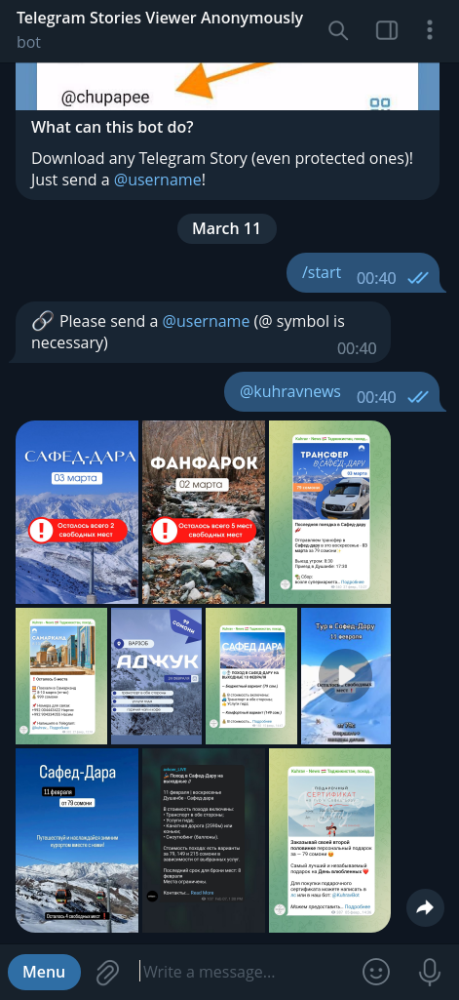
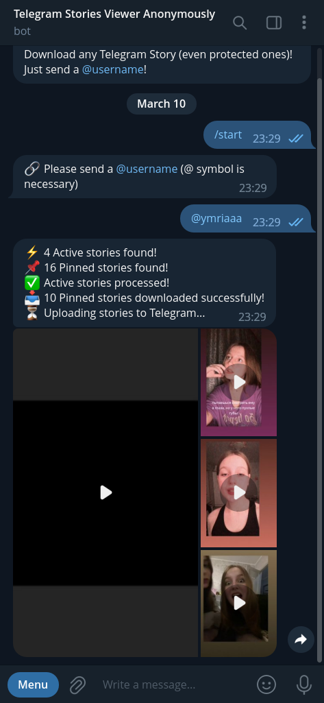
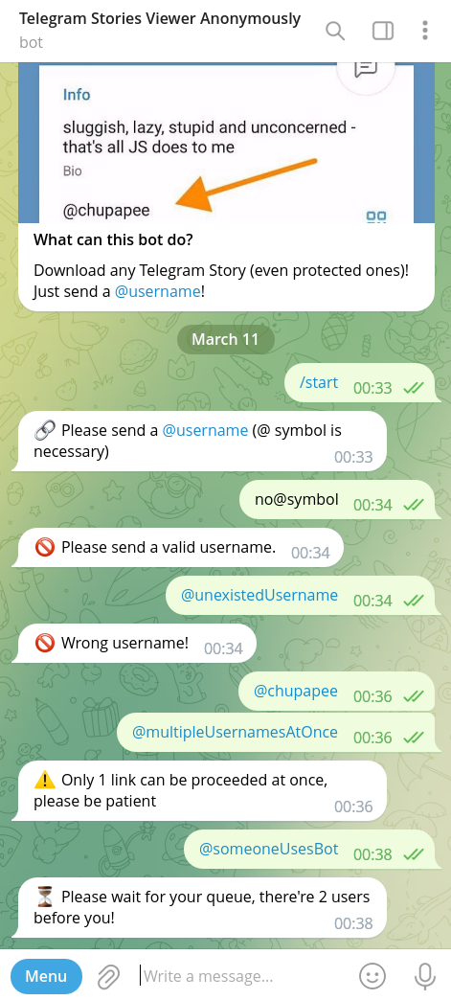

<h1><a href="https://t.me/tg_stories_downloader_bot">🕵🏼‍♂️ Telegram Stories Viewer Bot</a></h1>

<p>The bot allows to view Telegram stories <code>anonymously</code> by leveraging a bot and userbot</p>

<h2>📊 Bot usage statistics (as of January 28, 2025)</h2>

<table>
    <thead>
        <tr>
            <th>Metric</th>
            <th>Value</th>
        </tr>
    </thead>
    <tbody>
        <tr>
            <td><b>🟢 Active users count</b></td>
            <td><details><summary><b>12,335</b></summary></details></td>
        </tr>
        <tr>
            <td><b>👤 Total users count</b></td>
            <td><details><summary><b>33,425</b></summary></details></td>
        </tr>
        <tr>
            <td><b>🔄 Requests per day</b></td>
            <td><details><summary><b>~4,530</b></summary></details></td>
        </tr>
    </tbody>
</table>

<h2>📸 Screenshots</h2>

<table>
  <tr>
    <td></td>
    <td></td>
	</tr>
  <tr>
    <td></td>
    <td></td>
  </tr>
</table>

<h2>⚙️ How it works?</h2>

<details>

  <summary>Initiate the userbot:</summary>
  <br/>

  ```typescript
  import { TelegramClient } from 'telegram';
  import { StoreSession } from 'telegram/sessions';

  async function main() {
    const client = await initClient();
  }

  async function initClient() {
    const storeSession = new StoreSession('userbot-session');

    const client = new TelegramClient(
      storeSession,
      USERBOT_API_ID,
      USERBOT_API_HASH,
      {
        connectionRetries: 5,
      }
    );

    await client.start({
      phoneNumber: USERBOT_PHONE_NUMBER,
      password: async () => await input.text('Please enter your password: '),
      phoneCode: async () => await input.text('Please enter the code you received: '),
      onError: (err) => console.log('error: ', err),
    });
    console.log('You should now be connected.');
    console.log(client.session.save()); // Save the session to avoid logging in again
    await client.sendMessage('me', { message: 'Hi!' });

    return client;
  }
```

</details>

• Get user's entities by username:
```typescript
const username = '@chupapee';
const entity = await client.getEntity(username);
```
• Get stories data by entity:
```typescript
import { Api } from 'telegram';

const activeStories = await client.invoke(
  new Api.stories.GetPeerStories({ peer: entity })
);

const pinnedStories = await client.invoke(
  new Api.stories.GetPinnedStories({ peer: entity })
);
```
• Download stories using `media` prop of story object:
```typescript
const stories = await downloadStories(activeStories, pinnedStories);

async function downloadStories(activeStories, pinnedStories) {
  const result = [];

  for (const story of [...activeStories, ...pinnedStories]) {
    const buffer = await client.downloadMedia(story.media);
    if (buffer) {
      result.push({
        buffer,
        mediaType: 'photo' in story.media ? 'photo' : 'video',
      });
    }
  }

  return result;
}
```
• Send downloaded stories to user using Telegraf api (not Gramjs's userbot):
```typescript
import { Telegraf } from 'telegraf';

const bot = new Telegraf(BOT_TOKEN);
bot.telegram.sendMediaGroup(
  chatId,
  stories.map((story) => ({
    media: { source: story.buffer },
    type: story.mediaType,
  }))
)
```

<h2>🧰 Tools Used</h2>

🤖 <a href="https://gram.js.org/">GramJS</a> 🤖 - Provides access to the Telegram client API based on MTProto

👾 <a href="https://telegraf.js.org/">Telegraf</a> 👾 - Provides access to the Telegram bot API

☄️ <a href="https://effector.dev/">Effector</a> ☄️ - used for writing the business logic of the app, ensuring efficient state management and handling of complex workflows

📦 <a href="https://supabase.com/">Supabase</a> 📦 - integrated for analytics data collection

<h2>🛠 Setup</h2>
<p>To run this project locally, follow these steps:</p>

- Install all dependencies
```shell
yarn
```

- Configure Credentials:

Set up your Telegram and userbot credentials in the configuration file

- Start the bot:

Launch the bot in development mode using:
```shell
yarn dev
```

- Enter Userbot Login Code:

Upon starting the bot, you'll receive a login code from Telegram. Enter this code when prompted by the userbot

- Ready to Go:

Once the bot and userbot are up and running, the Telegram Story Viewer is ready to use!

<h2>🚀 Usage</h2>
Just send a message to the bot with the desired Telegram username, phone number, or the direct link to story. Wait for the bot to retrieve and deliver the stories back to you
